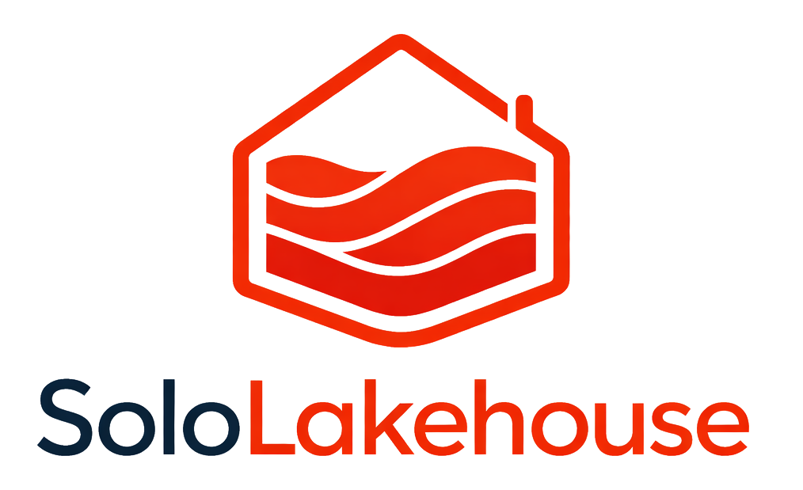

# Hi, I'm Jiahong Que 👋

<table>
<colgroup>
<col width="66%" />
<col width="34%" />
</colgroup>
<tr>
<td width="66%" valign="top">

I build **AI-ready data platforms** and **production-oriented ML systems** at the intersection of **lakehouse architecture, MLOps, and real-world industrial use cases**.

I am currently a **PhD Candidate** and **Research Assistant** in Germany, working on machine learning applications for logistics and air cargo systems. My long-term focus is to grow into a strong **AI / Data Platform Engineer** and eventually a **platform owner**.

</td>
<td width="34%" valign="middle" align="center">

</td>
</tr>
</table>

---

## Flagship work

| Project | What it is |
|:---|:---|
| **SoloLakehouse** | End-to-end **open-source reference lakehouse**: modular data layer, ML hooks, and observability — a credible blueprint for a **one-engineer AI-ready platform**. |
| **FinLakehouse** | **Governance-first** financial lakehouse: auditable analytics, feature pipelines, and ML workflows built for **regulated, audit-heavy** environments. |

---

## Where I go deep

---

## Stack I ship with

**Layers:** object storage & table formats · SQL engines & metastore · batch/orchestration · ML lifecycle · metrics, logs, and delivery to cluster.

---

## What I build

### SoloLakehouse

An **AI-ready personal lakehouse** in the spirit of modern platforms (Databricks, Snowflake, etc.) — proving that **one engineer** can wire up:

- durable **object storage** and **open table formats**
- **metadata** and **SQL** that analysts and ML can share
- **ML lifecycle** hooks without bolting on chaos at the end
- **observability** and **evolvable** platform boundaries

### FinLakehouse

A **governance-first** architecture for finance-scale data: **auditability**, controlled analytics paths, **ML-ready** pipelines, and operational discipline under **compliance pressure**.

---

## Proof of work

- **[SoloLakehouse_v1](https://github.com/Jiahong-Que-9527/SoloLakehouse_v1)** - open-source lakehouse platform (reference implementation you can fork and run).
- **FinLakehouse**（under construction）- governance-first financial lakehouse architecture and patterns (see repositories for related work).
- More experiments and repos on **[my GitHub](https://github.com/Jiahong-Que-9527)**.

---

## Research

**ML on real logistics systems** — air cargo visibility, sensor-based activity recognition, and intelligent operations. I care about papers that **land in systems**: reproducible pipelines, measurable latency and cost, and decisions you can defend in production.

---

## Connect

- [GitHub](https://github.com/Jiahong-Que-9527)
- [LinkedIn](https://www.linkedin.com/in/jiahong-que-215428258/)
- [Email](mailto:jiahong.que@fra-uas.de)

---

_Open to **collaboration**, **research**, and roles at the intersection of **AI engineering, data platforms, and ML systems**._ 🚀
