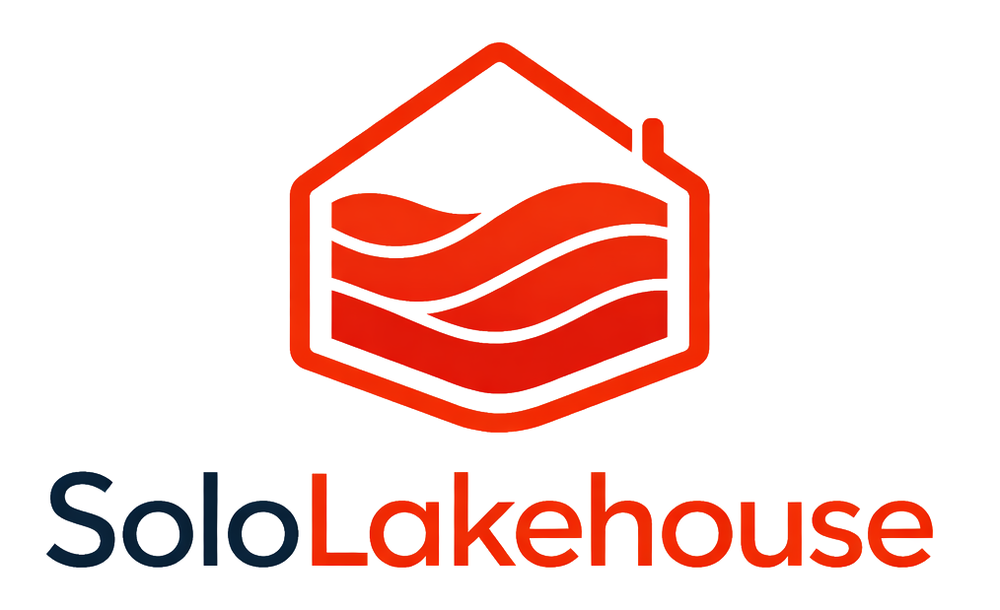

# Hi, I'm Jiahong Que

### Compliance-first Lakehouse · Data Platform Engineering · MLOps

Based in **Frankfurt am Main, Germany**. I build **AI-ready, audit-friendly data platforms** for regulated environments, with a focus on **open lakehouse architecture**, **ML systems**, and **EU financial regulation**.

  
  
  
  

---

## What I am building toward

I am currently a **PhD Candidate** and **Research Assistant**, working on machine learning applications in aviation operations. My engineering direction is clear: becoming a strong **Senior Platform / Data Engineer** for EU FinTech and other regulated data environments.

> I care about data platforms that are not only scalable, but also explainable, operable, and defensible under audit.

---

## Flagship Project: [SoloLakehouse](https://github.com/Jiahong-Que-9527/SoloLakehouse)

  
  
  

**SoloLakehouse (SLH)** is a self-hosted, cloud-neutral, compliance-first lakehouse reference architecture. It demonstrates how one engineer can design and operate a regulator-defensible data platform without depending on managed SaaS lakehouse vendors.

| Area | Design |
|:---|:---|
| **Core stack** | Apache Iceberg · Trino · Dagster · MLflow · MinIO / SeaweedFS · Superset · OpenMetadata |
| **Data path** | Bronze → Silver → Gold → ML, with explicit governance and lineage boundaries |
| **Compliance posture** | Architecture Decision Records covering DORA Article 28, ICT third-party risk, audit trail, lineage, and access control |
| **Differentiation** | Most open lakehouses optimize for scale. SLH optimizes for **regulatory defensibility**, where architecture decisions need to survive review |

  <a href="https://github.com/Jiahong-Que-9527/SoloLakehouse"><strong>Repository</strong></a>
  ·
  <a href="https://github.com/Jiahong-Que-9527/SoloLakehouse"><strong>Architecture</strong></a>
  ·
  <a href="https://github.com/Jiahong-Que-9527/SoloLakehouse"><strong>ADRs</strong></a>

---

## Stack I Ship With

  
  
  
  
  
  
  
  
  
  
  
  
  
  
  

**Platform layers:** object storage and open table formats · SQL engines and metadata · orchestration · ML lifecycle · governance and lineage · observability · IaC and delivery.

---

## Credentials

- **Databricks Certified Data Engineer Professional** （in progress）
- **Databricks Certified Generative AI Engineer Associate**
- **PhD Candidate**, Frankfurt University of Applied Sciences

---

## GitHub Activity

  
  

---

## Connect

  
  

Open to **collaboration with EU FinTech teams**, **research conversations**, and **Senior Platform / Data Engineer** opportunities at the intersection of data platforms, ML systems, and EU financial regulation.
